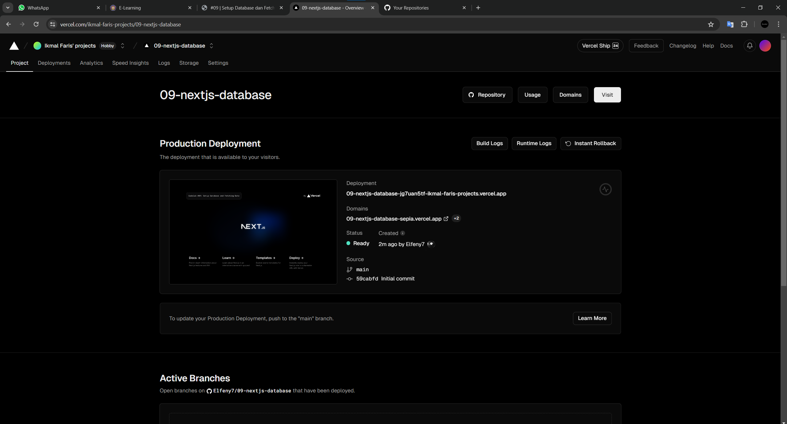
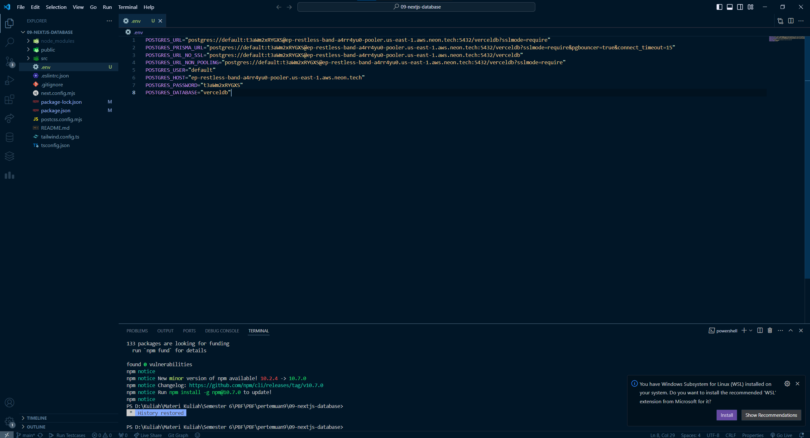
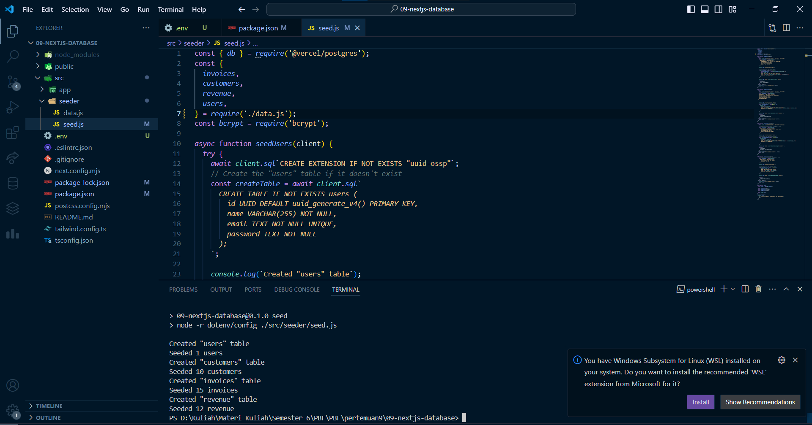
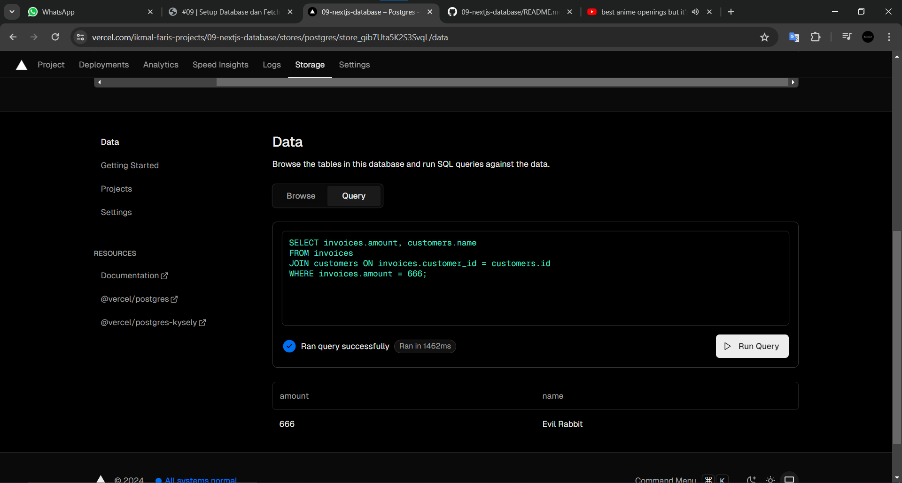
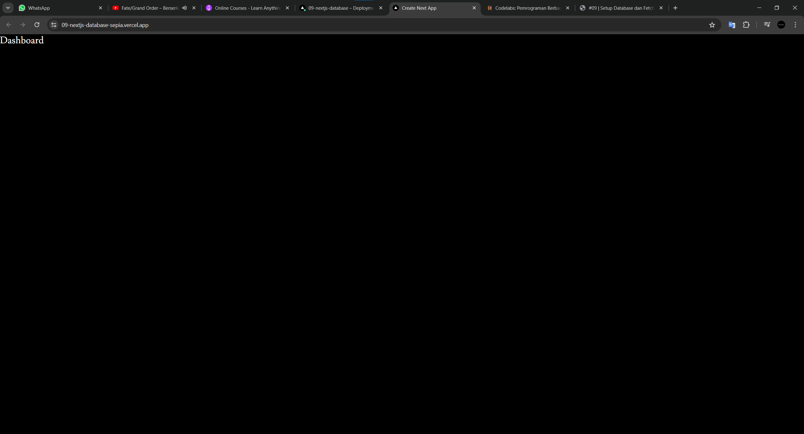
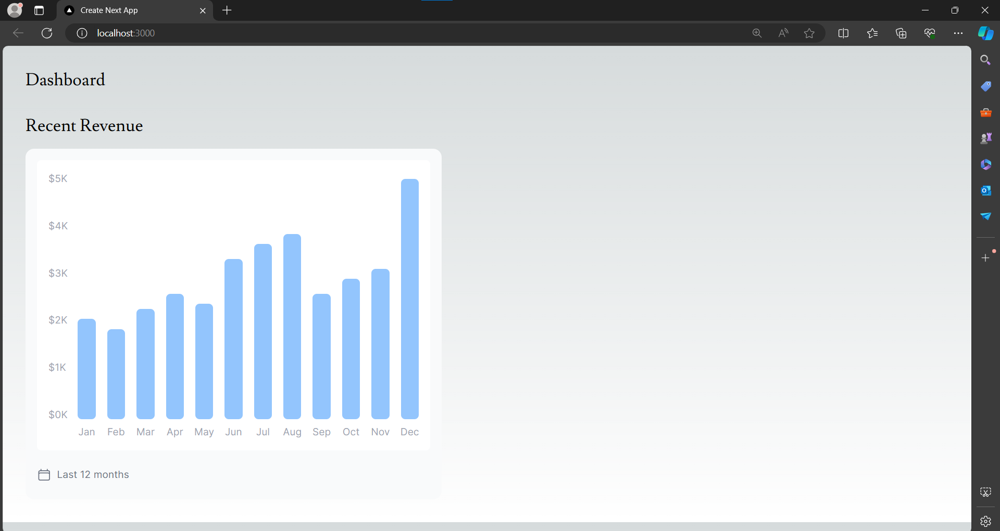
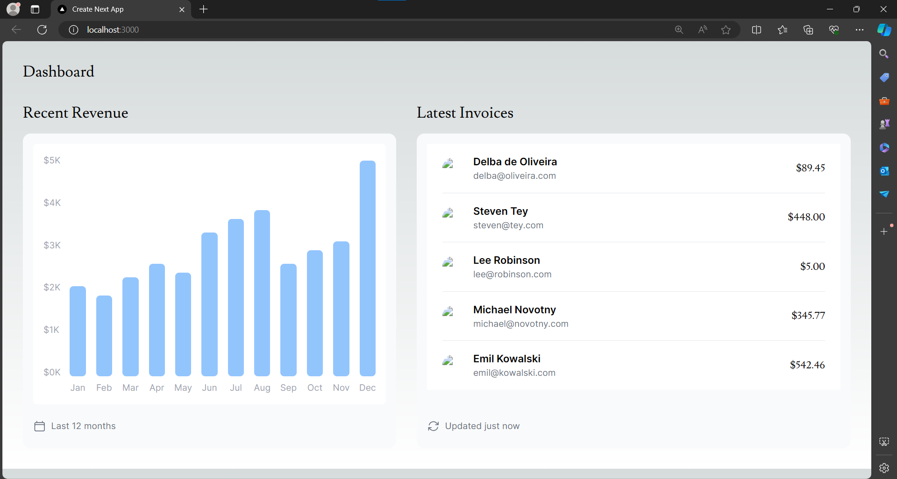
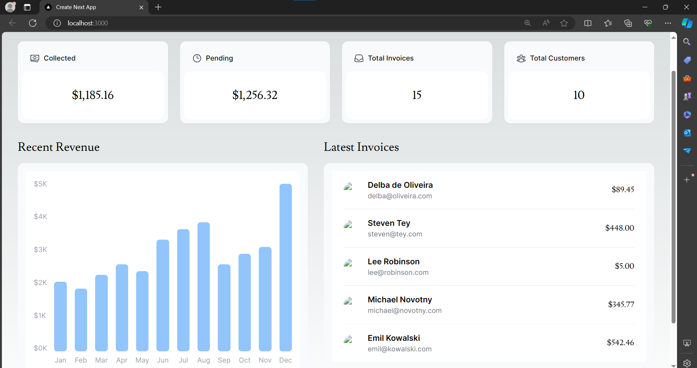

# Ikmal Faris Musyaffa
# 2141720123 / 06 / TI-3C
# Laporan Pertemuan 9

## Praktikum1
### Soal1

Jadi kita bisa mendeploy web dengan vercel tanpa perlu menggunakan server milik kita sendiri

### Soal2

file .env adalah penghubung database postgres dengan web vercel

### Soal3

Jadi kita bisa melakukan seed pada database dan otomatis terupdate di web vercel

### Soal4

Hasil dari Query, nampak berhasil dan berarti seeding telah berhasil dilakukan

## Praktikum2

### Soal5

Masih dicomment, karena menghindari error. Jadi kita dapat mendeploy dan fetch api menggunakan vercel

### Soal6

Bisa menampilkan 12 bulan dengan input manual dengan arbitrary value ```grid-cols-[25px_25px_25px_25px_25px_25px_25px_25px_25px_25px_25px_25px_25px]```

### Soal7

Hanya uncomment lalu menambahkan flex rows pada page.tsx

## Tugas Praktikum

### Nomor 1

Mengganti Card menjadi CardWrapper pada page.tsx

### Nomor 2
Karena CardWrapper ini membutuhkan 4 atribut tersebut, dan 4 atribut tersebut didapatkan dari ```fetchCardData()``` Jadi fungsi tersebut akan mereturn 4 value yang di mana setiap value nya mempunyai query sendiri seperti ini 
